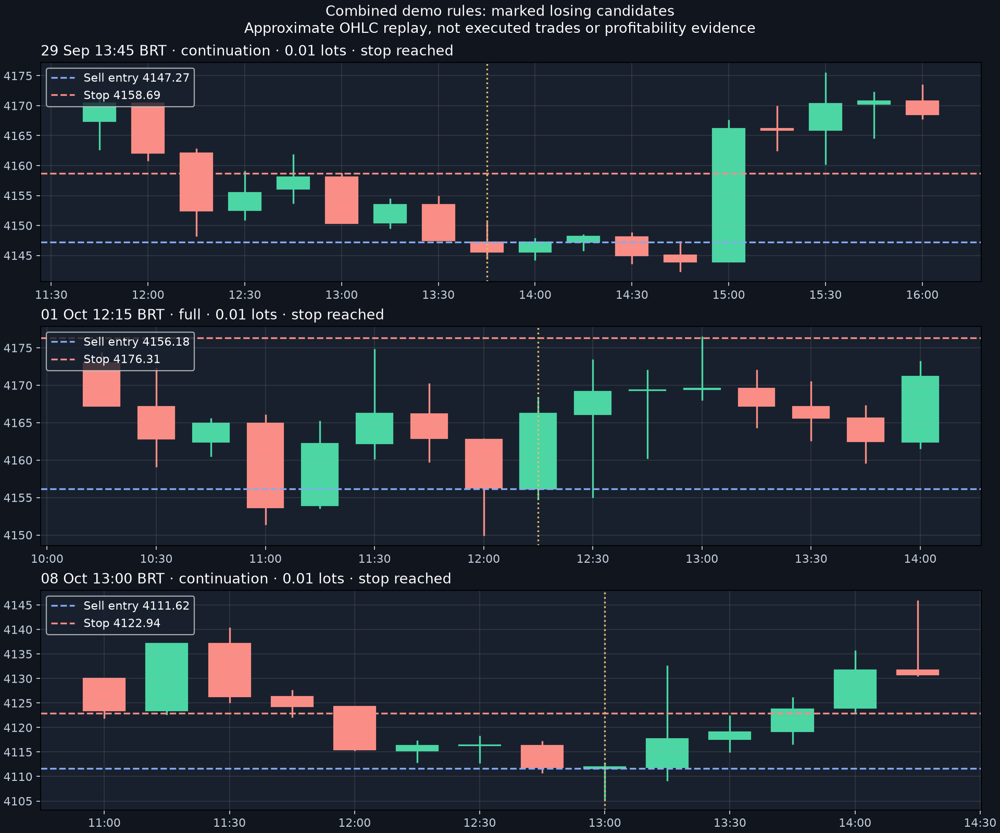

# XAUUSD demo recalibration — 9 October 2026

## Version 1.3.0

These are explicit demo interpretations of the discretionary strategy, not proof that the robot matches every human example. No marked human entry/stop examples were supplied for this calibration. The charts below mark broker-candle candidates, including losing ones.

### Trend and rebound

The original EMA direction remains the default: H4 EMA50/200 plus the closed price, with D1 or H1 agreement. A mixed H4 reading does **not** automatically permit trading.

The separate rebound path requires H1 and M15 agreement, an improving H4 EMA50, and a close beyond the preceding three H4 candles' structure within the latest three completed H4 bars. The break must establish a higher low (buy) or lower high (sell). Its protected level must remain intact, and subsequent closes may retrace at most 0.5 H4 ATR behind the break. Rebounds use half risk. This is a bounded structure proxy; it is not a universal definition of market structure.

### Timing, zone and BOS

- Retest and reaction thresholds use the **reaction candle's** EMA20 and ATR14. Confirmation still uses its own closed-candle EMA20 and ATR14.
- The BOS buffer and holding allowance use ATR from the break candle.
- The six-bar range proxy is replaced with a strict swing pivot: two candles on each side, already confirmed before the break. Search remains bounded to recent history; a close, not a wick, must break it.
- Retest penetration is capped at 1.5 reaction ATR; proximity is 0.35 ATR. This wider zone is a demo hypothesis tested separately, not an optimized profitable tolerance.
- Continuation remains a separate half-risk pattern after 10:00 New York, only before the first entry that day. It does not require all full-BOS gates.

Full risk remains 0.10% of initial balance, half risk 0.05%, 3R target, maximum six-hour hold. The 08:00–13:00 New York entry session and existing FTMO, news, loss, cooldown and request guards remain in effect. No trade quota was added.

## Independent replay

Frozen FTMO broker candles were captured at 14:50 UTC on 9 October. The replay period is 29 September–9 October. Each row below is a separate simulation; positions, cooldowns and losses mean the number of eligible checks can differ.

| Change | Checks | Signals | Sizing/geometry rejections | Wins | Losses |
|---|---:|---:|---:|---:|---:|
| Original | 161 | 18 | 14 | 0 | 4 |
| Rebound only | 161 | 18 | 14 | 0 | 4 |
| Candle references only | 163 | 16 | 13 | 0 | 3 |
| Zone only | 161 | 17 | 13 | 0 | 4 |
| Swing BOS only | 161 | 17 | 13 | 0 | 4 |
| Rebound + references | 163 | 16 | 13 | 0 | 3 |
| Combined | 163 | 16 | 13 | 0 | 3 |

“Rejections” includes stops beyond four ATR, invalid geometry and volume below the minimum. Signals are not necessarily executable orders. Checks exclude periods occupied by a simulated position or prevented by simulated cooldown/day limits.

The combined version admits a rebound direction today around 10:30–11:15 São Paulo, but it still does not produce an eligible entry there. Direction alone does not satisfy the pattern and timing gates.

### Losing examples admitted by the combined version

All times below are São Paulo. Each uses 0.01 lots and reaches its stop in the candle replay.

| Decision | Setup | Sell entry | Stop | Risk budget |
|---|---|---:|---:|---:|
| 29 September 13:45 | Continuation | 4147.27 | 4158.694 | $12.50 |
| 1 October 12:15 | Full | 4156.18 | 4176.308 | $25.00 |
| 8 October 13:00 | Continuation | 4111.62 | 4122.943 | $12.50 |

This is an OHLC signal experiment, **not a profitability backtest**. Historical news restrictions, FTMO account equity and manual trades were not reconstructed. Spread uses candle approximations; fees and slippage are omitted. When stop and target touch in the same candle, stop wins. Six-hour exits use candle closes. Python mirrors the rule definitions but native MQL signal parity has not been established by a Strategy Tester run.

## Diagnostics and evidence

Every completed M15 evaluation records closed prices, EMA/ATR values, reaction/confirmation OHLC, direction mode and individual gates. Unevaluated gates are explicitly separate from failed gates. `can_trade` / `operational_permission` describe operational permission; `signal_ready` describes the pattern. They are not interchangeable.

When a pattern exists, the office shows stop distance, minimum-lot risk, risk budget and calculated lots. The EA floors volume and rejects minimum lots that exceed budget; it does not increase risk to manufacture an entry. Values exclude fees/slippage.

Latest checks are reported in robot status. Supabase retains structured check history for 30 days, with one record per robot/bar/version. Every check is also printed in local MetaTrader Experts logs. During an office outage only the latest status is later synchronized; local logs preserve earlier checks, but they are not automatically backfilled to Supabase.

Verified: native compilation; frontend syntax and renderer checks; database trigger deduplication and rollback; replay of seven separate variants. Existing Supabase advisories concern intentional token-authenticated RPCs and private tables, plus disabled leaked-password protection; this migration introduced no new security warning.

## Activate the updated demo robot

1. The compiled 1.3.0 files are installed in the usual `OfficeRobot` folder. Refresh Expert Advisors in MT5.
2. Remove the old EA from the XAUUSD chart and attach **OfficeRobot → OfficeRobot** again. Keep the same robot token and demo account. Do not attach a second copy to another chart.
3. Confirm version **1.3.0** in the chart comment/office. The new attachment starts paused; press Start when ready for demo observation.
4. After the next M15 candle closes, inspect the entry diagnostics and recent checks in the office. Telegram continues to report commands, trades and the end-of-session no-trade summary; individual checks do not generate Telegram alerts.

The revised binary being installed does not prove the running chart has switched versions. Confirm the reported version before interpreting new diagnostics. Preserve demo operation; these replay results do not justify live deployment.
